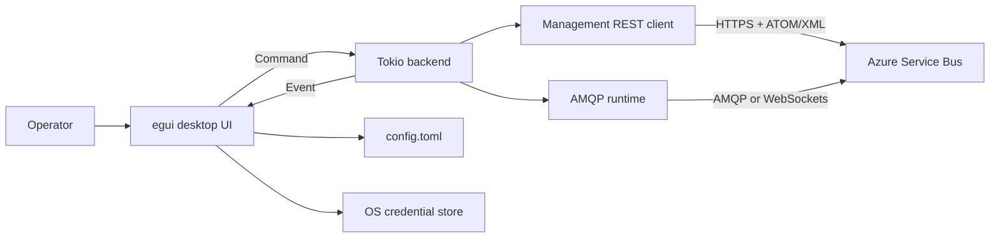
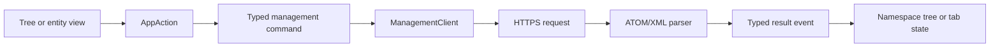

# Architecture

## System Context

sift is a native desktop application. The UI never performs network work
directly; it submits typed commands to a dedicated asynchronous backend and
applies typed events on later frames.



This split keeps frame rendering synchronous and predictable while allowing
management calls, AMQP receives, and bulk queue operations to run without
blocking the native event loop.

## Workspace Boundaries

### `sift-core`

The lowest-level domain crate owns data and policies that do not depend on the
GUI or a particular network client:

- tolerant Service Bus connection-string parsing
- AMQP transport selection and HTTPS management endpoint derivation
- SAS token generation and short-lived token caching
- versioned TOML configuration and atomic config writes
- redacted, zeroizing secret values and the secret-store abstraction
- legacy profile import
- body classification, gzip inflation, base64 detection, and binary hex dumps
- shared inbound and outbound message models

`SecretString` intentionally does not implement `Serialize`. This makes
accidentally writing credentials through the config model harder.

### `sift-mgmt`

The management crate owns the Azure Service Bus namespace management protocol:

- HTTPS requests authenticated with SAS
- paginated queue and topic feeds
- subscription and rule enumeration
- entity detail and runtime-count parsing
- queue, topic, subscription, and rule creation
- supported entity updates and deletes
- versioned JSON namespace export/import

Azure's management endpoint uses ATOM envelopes containing Service Bus XML
descriptions. Response parsing is namespace-tolerant. Request serialization is
hand-written because Azure validates description fields in schema order.

This crate has no UI dependency and can be tested independently with fixture
XML or a live namespace.

### `sift-backend`

The backend crate is the concurrency and transport boundary. It owns:

- the `Command` vocabulary sent by the UI
- the `Event` vocabulary returned to the UI
- request and long-operation identifiers
- a dedicated Tokio runtime on its own thread
- one connected namespace context per profile
- lazy AMQP runtime creation
- message conversion between `azservicebus` and `sift-core`
- cancellable purge and dead-letter resubmission workers

The backend depends on `sift-core` and `sift-mgmt`, but neither lower-level crate
depends on it.

### `sift`

The application crate exposes the reusable presentation and transient operator
state used by both front ends:

- menus, status and log panels
- multi-namespace entity trees and filters
- dashboard aggregation and refresh cadence
- docked and detached entity tabs
- connection, create, send, and confirmation dialogs
- message grids, body/property viewers, and session views
- toast notifications and progress strips
- stale-response filtering and view updates

UI interactions produce `AppAction` values first. The app reduces those actions
after the frame, either updating local state or translating them into backend
commands. This avoids deep widget code mutating unrelated application state.

### `sift-web-demo`

The website demo compiles the same entity tree, dock tabs, dashboard, message
grid, body inspector, and session views to WebAssembly. Its controller replaces
the native backend with deterministic in-memory queues and subscriptions.

A browser-local clock emits sample messages and updates runtime counts. Peek,
receive, settlement, defer, dead-letter, purge, resubmit, send, and session
actions mutate only that local state. Reset reconstructs the seed namespace.
The demo makes no network calls and stores nothing after the page closes.

Native-only modules remain outside the WebAssembly dependency graph:

- Azure management HTTP execution
- the Tokio AMQP runtime and `azservicebus`
- OS credential stores and file dialogs
- detached operating-system windows

This keeps the demo representative of the actual UI without pretending a
browser has access to desktop credentials or AMQP sockets.

## Runtime Model

```mermaid
sequenceDiagram
    participant UI as egui thread
    participant Handle as BackendHandle
    participant Loop as Tokio command loop
    participant Task as Async task/client
    participant Events as Event channel

    UI->>Handle: send(Command)
    Handle->>Loop: Tokio unbounded channel
    Loop->>Task: spawn or await operation
    Task->>Events: send(Event)
    Events-->>UI: crossbeam receiver
    Events-->>UI: request_repaint callback
    UI->>UI: drain events at frame start
```

Commands travel through a Tokio unbounded MPSC channel. Events travel back
through a crossbeam channel that the UI drains at the beginning of each frame.
Every event send also invokes an egui repaint callback, so completion does not
wait for unrelated user input.

There are two identifiers:

- `RequestId` correlates one response with a short request and lets views ignore
  stale results.
- `OpId` identifies a long-running purge or resubmit operation for progress and
  cancellation.

Namespaces use the saved profile UUID as `NamespaceId`. Entity tabs, requests,
and operations always include that namespace identifier, preventing state from
two simultaneous connections from colliding.

## Connection Lifecycle

1. The UI loads a `NamespaceProfile` from `config.toml`.
2. It resolves the connection string through `SecretStore`.
3. `NamespaceConnection` validates and normalizes the string, retaining the
   original only inside a redacted secret wrapper.
4. The backend builds a management client and validates access with
   `GET /$namespaceinfo`.
5. A successful connection stores the profile, parsed connection, management
   client, and an empty AMQP runtime slot.
6. AMQP is established lazily on the first messaging command.
7. Disconnect removes the namespace context and drops its clients.

The management client signs each resource URI independently. SAS keys are used
to mint cached, resource-specific tokens; a pre-signed SAS token is passed
through as provided.

## Management Flow

Entity lists are loaded lazily. Queues and topics are fetched when a namespace
connects, while subscriptions and rules are requested as their tree nodes are
expanded.



Entity mutations return the refreshed entity when Azure supplies it. The app
then updates open tabs and reloads the affected parent list. Errors retain a
short operator-facing message plus optional raw service detail for diagnostics.

Namespace exports walk parents before children and serialize descriptions for
queues, topics, subscriptions, and rules. Imports preserve that ordering so
topics exist before their subscriptions and rules. Existing entities can be
skipped or overwritten; individual failures are accumulated in the outcome
instead of aborting unrelated entities.

## Messaging Flow

`SbRuntime` wraps the `azservicebus` clients. A `MessageSource` pairs a queue or
subscription with a main/dead-letter selection, while `EntityPath` keeps
addressing consistent across management and messaging commands.

Inbound bodies are normalized into `DecodedBody`:

1. Preserve the original bytes.
2. Detect gzip by magic bytes and inflate with a 64 MiB limit.
3. Classify UTF-8 data as JSON, XML, or text.
4. Retain non-text payloads as binary and render a bounded hex dump on demand.
5. Represent AMQP value or sequence sections as a textual preview when raw
   bytes are not available.

Preserving the original data section lets resend and resubmit retain binary or
compressed payload fidelity. Resend removes Service Bus-owned system properties
while keeping the body and eligible application properties.

The native message file workflow uses a versioned `sift-message` JSON envelope.
UTF-8 bodies remain text in the file; binary and gzip bodies use base64. The
envelope carries only fields that can be supplied on a new outbound message:
message and correlation ids, subject, content type, session and addressing
fields, TTL, and application properties. Sequence numbers, locks, delivery
counts, enqueue timestamps, and dead-letter metadata are intentionally omitted.
Raw payload export bypasses the envelope and writes the preserved data-section
bytes directly.

Peek-lock receives return a lock token to the UI. Complete, abandon, defer, and
dead-letter commands send that token back to the backend. Receive-and-delete is
separate and is presented as a destructive action. Deferred retrieval and
scheduled cancellation use Service Bus sequence numbers.

Session browsing intentionally has a narrow contract: accept the next or named
session, read its custom state, peek a bounded message set, and release the
session lock. Session settlement is not currently exposed.

## Long-Running Operations

Purge and dead-letter resubmission do not use the shared AMQP runtime mutex.
Each operation opens a dedicated AMQP connection, drains in bounded batches,
reports progress after each batch, and checks a cancellation token between
waits.

This prevents a bulk drain from blocking normal browsing and sends. It also
gives the UI a stable `OpId` for the progress strip and Cancel action.

## Persistence and Secrets

The config is a versioned TOML document written atomically through a temporary
file and rename. It stores:

- UI preferences
- retry settings
- saved namespace profile metadata
- transport and auto-connect choices

Connection strings and keys are stored separately under a profile UUID in the
platform credential store:

- Windows Credential Manager
- macOS Keychain
- Linux Secret Service

A startup probe selects the platform keyring or a session-only in-memory
fallback. Secrets are redacted in debug output and zeroized when their owned
buffers are dropped.

## Failure and Safety Model

- Network and protocol failures cross the backend boundary as `BackendError`.
- Views keep loading and error states explicitly rather than inferring them
  from empty collections.
- Request IDs prevent late responses from replacing newer view data.
- Entity deletion and message purging can require typed-name confirmation.
- Bulk operations are cancellable and isolated from the shared AMQP client.
- Gzip expansion and hex rendering are bounded.
- Config writes are atomic.
- Namespace exports exclude credentials, messages, and runtime counters.
- Unsafe Rust is denied workspace-wide.

## Testing Strategy

Fast tests cover connection parsing, SAS signing, body classification, secret
redaction, config round trips, XML parsing and writing, duration handling, and
UI-independent state behavior.

Live tests are opt-in:

- `SIFT_TEST_SB_CONNECTION_STRING` enables read-only namespace checks.
- `SIFT_TEST_SB_MUTATE=1` enables entity and messaging scenarios.
- Mutating tests create UUID-qualified `sift-test-*` entities and remove them
  when complete.

CI runs formatting, Clippy with warnings denied, unit/integration tests, and a
workspace build on both Linux and Windows.

## Adding a Capability

A typical feature crosses the layers in this order:

1. Add or extend domain data in `sift-core` or `sift-mgmt`.
2. Add a typed `Command` and result `Event` in `sift-backend::bridge`.
3. Implement the async operation in the backend or `SbRuntime`.
4. Add an `AppAction` and dispatch it from the UI.
5. Apply the event to namespace, tab, dialog, or operation state.
6. Add fast tests at the lowest layer that owns the behavior and a live test
   when protocol compatibility is the risk.

Keep Azure protocol details below the bridge and egui types above it. That
dependency direction is what makes the management and messaging logic usable
without constructing a desktop application.
